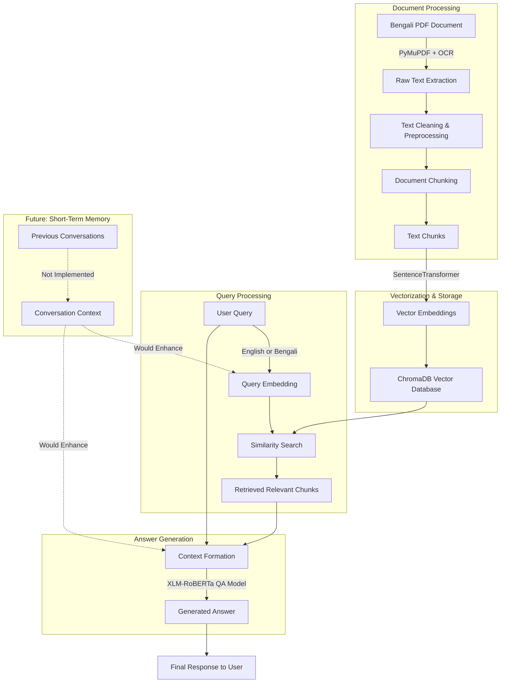

# Multilingual Retrieval-Augmented Generation (RAG) System

## Overview

This project implements a basic Multilingual Retrieval-Augmented Generation (RAG) system capable of understanding and responding to queries in both English and Bengali. The system leverages a PDF document as its knowledge base, extracts and preprocesses text, converts it into numerical vectors for efficient retrieval, and then uses a powerful language model to generate answers grounded in the retrieved information.

The RAG system is designed with the following core functionalities:

* **Multilingual Query Acceptance:** Accepts user queries in both English and Bengali.

* **Knowledge Base Construction:** Builds a knowledge base from a PDF document (`HSC26 Bangla 1st paper.pdf`).

* **Text Pre-processing & Chunking:** Cleans and divides the extracted text into manageable chunks.

* **Vectorization & Storage (Long-Term Memory):** Converts text chunks into numerical embeddings and stores them in a vector database (ChromaDB) for semantic search.

* **Retrieval Module:** Identifies and retrieves the most relevant document chunks based on user queries.

* **Generation Module:** Generates coherent and contextually relevant answers using a Question Answering (QA) language model.

## Project Structure and Workflow
## System Architecture (Flowchart)

Here's a visual representation of the RAG system's architecture and data flow:


The RAG pipeline follows these sequential steps:

1.  **Text Extraction:** Extracts raw text from the PDF document, attempting OCR for image-based text if direct extraction fails.

    * **Method/Library:** `PyMuPDF` is used for direct text extraction, and `pytesseract` (along with `PIL` and `io`) serves as a fallback for Optical Character Recognition (OCR) when direct extraction yields no text.

    * **Reasoning:** `PyMuPDF` is efficient for extracting text directly from text-based PDFs. `pytesseract` is crucial for handling scanned documents or PDFs where text is embedded as images, ensuring comprehensive text capture.

    * **Challenges:** The process faced formatting challenges, as indicated by the need for OCR when direct extraction failed, suggesting the PDF contained image-based text. Further cleaning was required due to varied formatting.

2.  **Pre-processing and Data Cleaning:** Cleans the extracted text by removing unwanted patterns (e.g., multiple newlines, excessive whitespace) and handling potential encoding issues.

3.  **Document Chunking:** Divides the cleaned text into overlapping chunks to ensure that relevant information is captured and context is maintained for retrieval.

    * **Strategy:** A character-limit based chunking strategy is employed, with `chunk_size=500` characters and `chunk_overlap=100` characters.

    * **Effectiveness for Semantic Retrieval:** This strategy works well by creating manageable text segments that are small enough to maintain semantic coherence, yet large enough to retain sufficient context for meaningful retrieval. The overlap helps to prevent loss of context at chunk boundaries.

4.  **Vectorization & Storage:**

    * **Embedding Model:** The `paraphrase-multilingual-MiniLM-L12-v2` model from the `sentence-transformers` library is used to create numerical embeddings.

    * **Reasoning for Choice:** This model was selected for its multilingual capabilities, making it suitable for processing both English and Bengali text. It is also relatively lightweight, balancing performance with resource usage.

    * **Meaning Capture:** This model captures the meaning of text by mapping sentences into a high-dimensional vector space. Semantically similar sentences are positioned closer together in this space, allowing for effective semantic search.

    * **Storage Setup:** ChromaDB is used as the in-memory vector database. It was chosen for its lightweight nature and ease of setup, making it ideal for smaller-scale projects and rapid prototyping.

5.  **Retrieval Module:** Embeds the user's query using the same Sentence Transformer model and performs a similarity search in the ChromaDB collection to find and retrieve the `n` most relevant document chunks.

    * **Comparison Method:** Cosine similarity is used to compare the query embedding with the stored chunk embeddings.

    * **Reasoning for Method:** Cosine similarity measures the cosine of the angle between two vectors. A cosine value closer to 1 indicates that the vectors are pointing in a similar direction, signifying a high degree of semantic similarity. This method is highly effective for semantic search tasks as it focuses on the orientation of the vectors rather than their magnitude, making it robust to differences in text length.

6.  **Generation Module:**

    * Initial attempts with `gpt2` for text generation faced context length limitations.

    * Switched to a more suitable multilingual Question Answering (QA) model: `deepset/xlm-roberta-large-squad2`.

    * Constructs a prompt by combining the user query and the retrieved document chunks.

    * Uses the QA pipeline to generate an answer grounded in the provided context.

7.  **Orchestration (RAG Pipeline):** A central function (`rag_pipeline`) integrates the retrieval and generation components to provide an end-to-end question-answering system.

## Key Components and Technologies

* **PDF Text Extraction:** `PyMuPDF`, `pytesseract` (for OCR)

* **Text Pre-processing:** Python's `re` module (regular expressions)

* **Embedding Model:** `sentence-transformers` library, specifically `paraphrase-multilingual-MiniLM-L12-v2`

* **Vector Database:** `chromadb` (in-memory for simplicity)

* **Question Answering Model:** `transformers` library, specifically `deepset/xlm-roberta-large-squad2`

* **Core Language:** Python

## Setup and Installation

To set up and run this RAG system, follow these steps:

1.  **Clone the repository (if applicable) or ensure you have the Jupyter Notebook file.**

2.  **Install the required Python libraries:**

    ```bash
    pip install PyMuPDF pytesseract sentence-transformers chromadb transformers
    ```

3.  **Download Tesseract OCR (if not already installed and in your PATH):**

    * For Debian/Ubuntu: `sudo apt-get install tesseract-ocr tesseract-ocr-ben` (for Bengali language support)

    * For other operating systems, refer to the [Tesseract documentation](https://tesseract-ocr.github.io/tessdoc/Installation.html). You might need to set the `pytesseract.pytesseract.tesseract_cmd` variable in your Python script to the path of your Tesseract executable.

4.  **Place the PDF document:** Ensure the `HSC26-Bangla1st-Paper.pdf` file is in the same directory as your Jupyter Notebook or Python script.

## Usage

To use the RAG system:

1.  **Run the Jupyter Notebook cells sequentially.** Each cell performs a specific subtask (text extraction, cleaning, chunking, vectorization, model loading, and RAG pipeline demonstration).

2.  **Interact with the `rag_pipeline` function:** Once all cells have been executed, you can use the `rag_pipeline` function with your own English or Bengali queries.

    ```python
    # Example usage after running all notebook cells
    user_query_english = "What was Anupam's father's profession?"
    answer_english = rag_pipeline(user_query_english, collection, model, generator)
    print(f"English Query: {user_query_english}")
    print(f"Generated Answer: {answer_english}")

    user_query_bengali = "অনুপমের বাবার পেশা কি ছিল?"
    answer_bengali = rag_pipeline(user_query_bengali, collection, model, generator)
    print(f"Bengali Query: {user_query_bengali}")
    print(f"Generated Answer: {bengali_answer}")
    ```

## Insights and Future Enhancements

* **Answer Quality:** While the core RAG pipeline is functional, the quality of generated answers, particularly for Bengali queries based on the specific PDF content, can be basic. This indicates potential areas for improvement.

    * **Relevance of Results:** The current results, as observed in the notebook output, are not consistently relevant and sometimes return only fragments. This suggests that while the system retrieves *something*, it might not be the most precise or complete answer.

* **Handling Vague Queries:**

    * **Meaningful Comparison:** The system ensures meaningful comparison by converting both the query and document chunks into a shared semantic vector space using the embedding model. Cosine similarity then quantifies their semantic relatedness. The QA model (`deepset/xlm-roberta-large-squad2`) is specifically designed to extract answers from a given context based on a question, which helps ground the response.

    * **Impact of Vague/Missing Context:** If a query is vague or lacks context, the embedding model might struggle to find highly specific matches, leading to the retrieval of less relevant or a broader set of chunks. Consequently, the QA model, even if powerful, can only generate an answer based on the quality of the provided context. If the retrieved chunks are irrelevant or insufficient, the generated answer will likely be generic, incorrect, or incomplete, as seen in the initial `gpt2` and `xlm-roberta` outputs where answers were fragmented or indicated errors.

* **Retrieval Refinement:**

    * Experiment with different chunking strategies (e.g., semantic chunking, fixed-size chunks based on tokens instead of characters).

    * Explore advanced retrieval techniques beyond simple similarity search, such as re-ranking retrieved documents.

* **Model Fine-tuning:** Fine-tuning the QA model (`deepset/xlm-roberta-large-squad2`) on domain-specific Bengali and English data relevant to the PDF content could significantly improve answer relevance and coherence.

* **Short-Term Memory (Conversational Context):** Implementing a short-term memory component to track recent chat history would enhance the system's ability to handle conversational follow-ups and maintain context across multiple turns. This would lead to a more natural and intelligent user experience.

* **Scalability:** For larger document corpuses, consider more robust vector databases (e.g., Pinecone, Weaviate, Faiss) and distributed processing.
